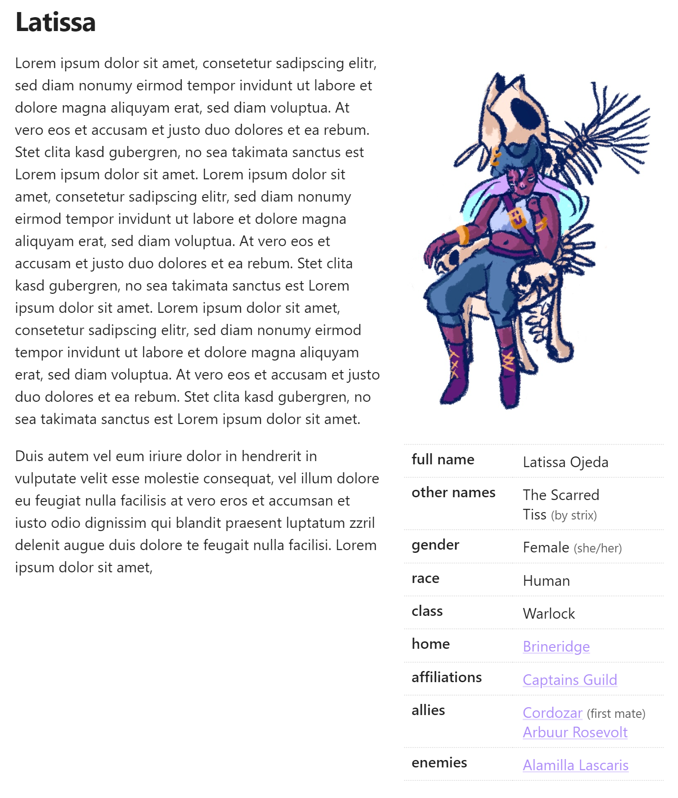

# Obsidian Aside

> An Obsidian plugin to create aside sections within your notes.

## Usage
  
- Insert a codeblock with the `aside` tag.
- Provide your content in YAML format.

The following properties are supported:

| Property      | Expected Value      | Description                                                               |
| ------------- | ------------------- |-------------------------------------------------------------------------- |
| `thumbnail`   | Markdown Image Link | Renders the given image at the top of the aside section.                  |
| `content`     | Object              | Renders all properties of the given object as a table of key value pairs. |
| `sortContent` | Boolean             | Determines whether the content should be sorted alphabetically.           |

### Example

The following shows an example of how the aside section is displayed.

````md
```aside
thumbnail: '![[latissa.jpg]]'
sortContent: false
content:
 full name: 'Latissa Ojeda'
 other names:
  - 'The Scarred'
  - 'Tiss (by strix)'
 gender: 'Female (she/her)'
 race: 'Human'
 class: 'Warlock'
 home: '[[Brineridge]]'
 affiliations:
  - '[[Captains Guild]]'
 allies:
  - '[[Cordozar]] (first mate)'
  - '[[Arbuur Rosevolt]]'
 enemies:
  - '[[Alamilla Lascaris]]'
```
````


